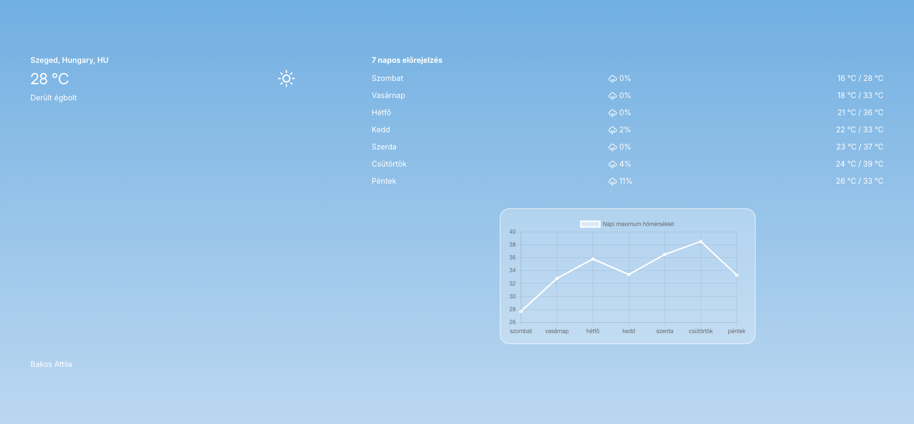

# mweather

Webfejlesztési próbafeladat megoldása.

Ez az alkalmazás valós idejű időjárási adatokat jelenít meg egy kiválasztott városra.  
Főbb funkciók:

- Aktuális időjárás megjelenítése
- 7 napos előrejelzés, csapadékvalószínűséggel, minimum- és maximum-hőmérséklettel
- Napi maximum hőmérsékletek vizuális megjelenítése diagramon
- Az időjárási viszonyokhoz igazodó, dinamikusan változó UI

## Telepítési útmutató

1. **Csomagok telepítése**:

```
npm install
```

## Használati útmutató

**Teszteléshez, fejlesztéshez**:

```
npm run dev
```

**Build**:

```
npm run build

```

## Felhasznált technológiák

A projektben az alábbi külső könyvtárakat és erőforrásokat használtam:

- [Onsen UI](https://onsen.io/) – Mobilbarát UI komponensek
- [Weather Icons](https://erikflowers.github.io/weather-icons/) – Időjárás ikonok
- [React Chart.js 2](https://react-chartjs-2.js.org/) – Adatvizualizáció Chart.js alapokon

## Képernyőképek

A következő képernyőképek bemutatják az alkalmazás működését:


*Főoldal megjelenése*


*Helyszín megadása beviteli mezővel*


*Helyszín kiválasztása több találat esetén*


*Dinamikusan változó téma az időjárási adatok szerint*


*Mobilos nézet*


*Mobilos nézet*


*Mobilos nézet*